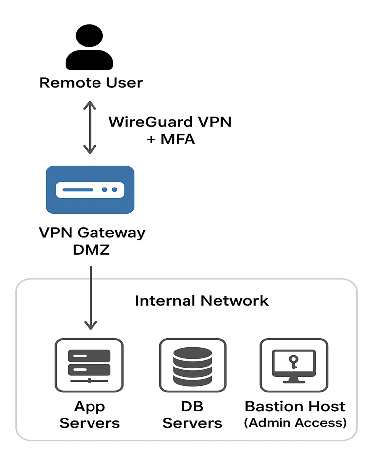

# Establishing a Secure Remote Access Solution for Employees

## ⭐ Project Highlights
- Secure remote access using VPN technology
- Multi-Factor Authentication (MFA) for all remote logins
- Zero Trust Architecture with network segmentation
- Endpoint Security and compliance enforcement
- Centralized monitoring and logging (SIEM)

---

## 📌 Project Overview
This project focuses on designing and implementing a secure remote access solution for employees working remotely or while traveling. The goal is to ensure confidentiality, integrity, and authentication of remote connections while protecting organizational resources from unauthorized access.

---

## 🎯 Objectives
- Secure remote connectivity using VPNs
- Strong encryption and authentication
- Endpoint security enforcement
- Zero Trust architecture implementation
- Continuous monitoring and logging
- Compliance with security regulations

---

## 🛠 Technologies & Concepts Used
- IPSec VPN
- SSL/TLS VPN
- AES-256 Encryption
- Multi-Factor Authentication (MFA)
- Identity and Access Management (IAM)
- Endpoint Detection & Response (EDR)
- Zero Trust Architecture
- Network Segmentation
- Secure RDP
- Centralized Logging (SIEM)

---

## 🧩 Project Components
- Remote Access Solution Design
- VPN Configuration (IPSec & SSL/TLS)
- MFA and IAM Integration
- Endpoint Security & Compliance
- Zero Trust & Network Segmentation
- Secure Remote Desktop & File Sharing
- Monitoring & Centralized Logging
- Security Policies & Compliance

---

## 🔬 Practical Implementation
- Assessed remote access infrastructure
- Identified security gaps
- Configured VPNs and tested encryption
- Implemented Multi-Factor Authentication (MFA)
- Deployed endpoint protection solutions
- Applied Zero Trust principles
- Monitored and analyzed security logs

---

## 📄 Documentation
- [Project Overview](Project_Overview/Project_Description.md)
- [VPN Configuration](VPN_Configuration/)
- [MFA & IAM](MFA_IAM/MFA_IAM_Implementation.md)
- [Endpoint Security](Endpoint_Security/Endpoint_Protection_and_Compliance.md)
- [Zero Trust Design](Zero_Trust_Network/Zero_Trust_and_Segmentation.md)
- [Monitoring & Logging](Monitoring_Logging/Monitoring_and_Logging.md)
- [Policies & Compliance](Policies_and_Compliance/Remote_Access_Policies.md)

---

## 🖼 Architecture Diagram

---

## 👤 Author
**Jheel Girish Bhandia**  
Cyber Security & Ethical Hacking (Fresher)
